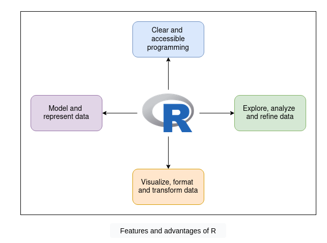

# R - Introducción

## ¿Qué es R?

- R es un lenguaje de programación y un entorno de software libre para **computación estadística y gráficos**.
- Proporciona herramientas para manipular datos, realizar análisis estadísticos y crear visualizaciones.



## R y Data Science

- R es ampliamente utilizado en ciencia de datos para **análisis de datos**, **visualización** y **machine learning**.
- Permite explorar, transformar y modelar datos de forma eficiente.

## Primeros pasos

### Ejecutar código

- El código se escribe en archivos `.r` y se ejecuta con `Rscript archivo.r`.
- Los comentarios se escriben con `#`.

### Imprimir en consola

- `print()`: muestra la representación de un objeto (incluye comillas en strings).
- `cat()`: concatena y muestra texto sin formato adicional, ideal para salida limpia.

```r
print("Hola mundo")        # imprime con comillas
cat("Hola mundo\n")        # imprime sin comillas
```

### Secuencias de escape

- `\n`: salto de línea
- `\t`: tabulación
- `\"`: comillas dobles dentro de un string

```r
cat("Felipe dijo: \"Hola mundo\"\n")
```
