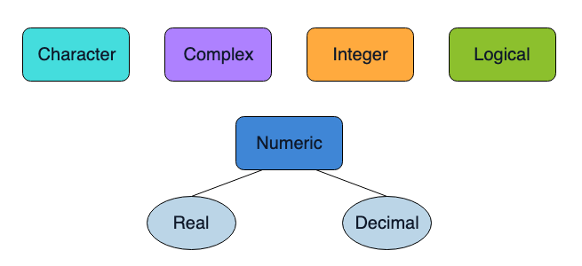
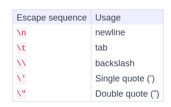

# Data Types

- R is a language designed to store, manipulate, and work with Data.
- R provides several specialized data structures referred to as objects.

## Variables

- Variables are used to store data.
- 

- class vs typeof:
    - class es la categoría general a la que pertenece un objeto (por ejemplo, "numeric", "character", "data.frame").
    - typeof es el tipo de datos específico que describe cómo se almacena el objeto en memoria (por ejemplo, "double", "integer", "character").

## Basic Methods for Handling Variables

- Listening: `ls()`
- Removing: `rm()`, para remover variables especificas

## Strings

- Se crean como cadenas de caracteres usando comillas dobles o simples.
- Se pueden usar funciones como `cat()` para imprimir cadenas de caracteres.
- 

## Difference between `cat()` and `print()`

- `print()` es una función genérica que muestra la representación de un objeto en la consola, incluyendo comillas para cadenas de caracteres y otros detalles de formato.
- `cat()` es una función que concatena y muestra cadenas de caracteres sin comillas ni formato adicional, lo que la hace útil para imprimir texto de manera más limpia y legible.