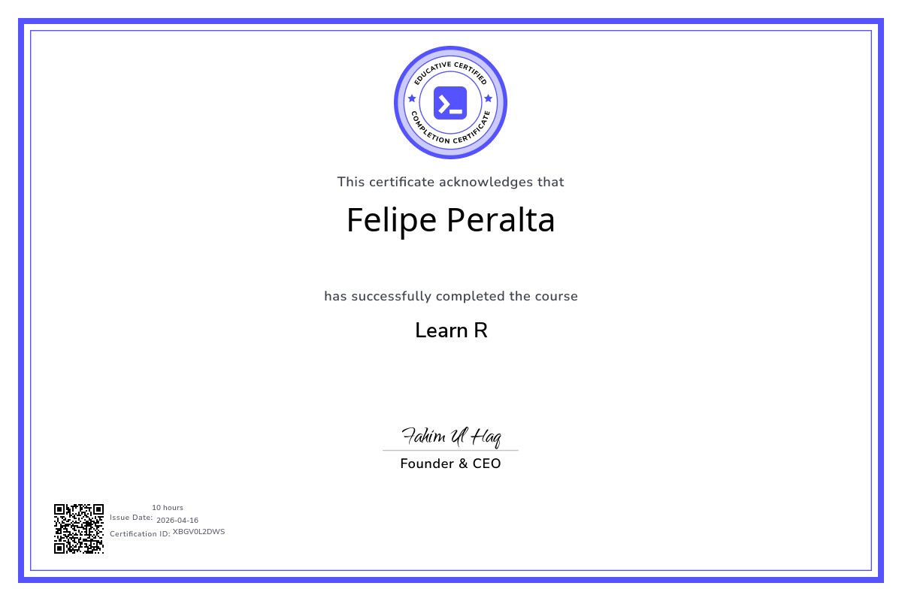

# Curso de R - Educative.io

Certificado de completación del curso de R en Educative.io.

## Certificado



## Logros

Este curso cubre los fundamentos del lenguaje de programación R, desde conceptos básicos hasta programación orientada a objetos.

## Contenido del Curso

### 1. Introducción a R
- Visión general del lenguaje
- Configuración del entorno

### 2. Variables y Tipos de Datos
- Declaración de variables
- Tipos de datos: numeric, integer, character, logical, complex
- Coerción de tipos

### 3. Estructuras de Datos
- Vectores
- Listas
- Matrices
- Arrays
- Factores
- Data Frames

### 4. Operadores
- Aritméticos
- Relacionales
- Lógicos
- De asignación
- Misceláneos

### 5. Condicionales y Bucles
- `if-else` y anidamiento
- `ifelse()` vectorizado
- `switch`
- Bucles `while`, `for`, `repeat`
- Control de flujo con `break` y `next`

### 6. Funciones
- Definición de funciones
- Argumentos por defecto
- Múltiples parámetros
- Múltiples valores de retorno
- Funciones anidadas
- Recursión (factorial, Fibonacci)

### 7. Entrada y Salida
- Input desde consola
- Manejo de archivos de texto (lectura, escritura, procesamiento)
- Manejo de archivos CSV (lectura, escritura, append)

### 8. Manejo de Excepciones
- Errores vs advertencias
- `tryCatch()` para capturar excepciones
- Generar advertencias con `warning()`
- Suprimir advertencias con `suppressWarnings()`
- Detener ejecución con `stop()`

### 9. Clases y POO
- Sistema S3 (flexible, convenciones)
- Sistema S4 (formal, slots con tipos)
- Sistema R6 (moderno, orientado a objetos clásico)
- Comparación de sistemas de clases

### 10. Desafíos
- Ejercicios prácticos para reforzar los conocimientos

## Estructura del Proyecto

```
learn_r/
├── 01_introduction/
├── 02_variables/
├── 03_data_structures/
├── 04_operators/
├── 05_conditionals_and_loops/
├── 06_functions/
├── 07_input_output/
├── 08_exceptions_handling/
├── 09_classes/
├── 10_challenges/
└── r0w3pLt1ZDoqj8EKLhx1WP4VZMJyI6.png  # Certificado
```

Cada sección contiene:
- Documentación en formato Markdown (.md)
- Scripts de ejemplo (.r)
